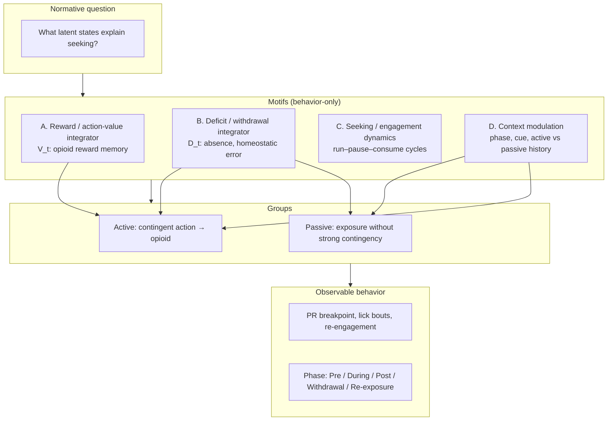
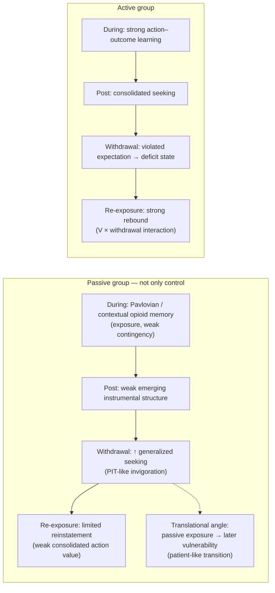
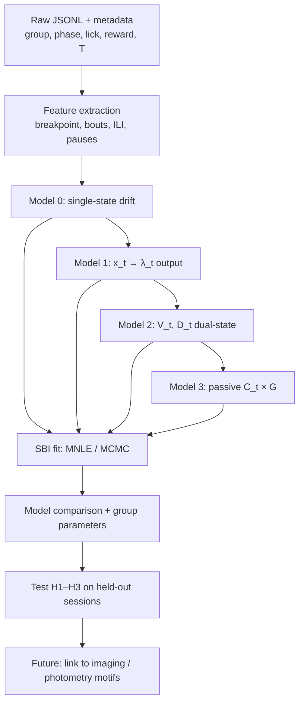

# Opioid Seeking: Computational Framework & CS Collaboration Proposal

**Behavior-only first** (no neural data required for initial fitting). Neural / imaging extensions follow after latent dynamics are established.

---

## 1. Normative / computational question

| Language | Question |
|----------|----------|
| **KO** | Opioid self-administration 동물은 무엇을 maximize / regulate하는가? 언제 lick / seek / escalate 할까? Withdrawal 이후 왜 re-exposure motivation이 커질까? Passive exposure만으로는 왜 같은 phenotype이 안 생기는가? |
| **EN** | What do animals maximize or regulate during opioid self-administration? When do they lick, seek, or escalate? Why does re-exposure motivation increase after withdrawal? Why does passive exposure alone not produce the same phenotype? |

**Core claim:** Opioid seeking is not independent trial-by-trial responding. It reflects **slowly accumulating latent states** (reward history, deficit/withdrawal, context gain) that govern engagement, disengagement, and re-engagement—especially on PR and across phases (During → Post → Withdrawal → Re-exposure).

---

## 2. Conceptual logic flow (seminar motifs → addiction paradigm)

### Motif mapping (seminar → your task)

| Motif | Seminar idea | Addiction mapping |
|-------|----------------|-------------------|
| **A. Reward integrator** | Reward expectation state | Opioid reward / action-outcome memory; stronger in **active** (contingency) |
| **B. Deficit integrator** | Slow negative / withdrawal mode | Homeostatic error, allostatic deficit, relief expectation during abstinence |
| **C. Seeking oscillator** | Run/stop rhythm | Lick bouts, approach–withdrawal, cue checking, effort microstructure |
| **D. Context gain** | Patch / odor modulates input | Drug available, chamber, withdrawal, cue re-exposure, passive vs active history |

**Two slow axes (required):**

1. **Drug reward axis** — remembers contingent opioid value (`V_t`)
2. **Drug absence / deficit axis** — accumulates burden during abstinence (`D_t`)

Active re-exposure amplification = **interaction** of these axes + context gain, not exposure alone.

---

## 3. Group logic (including passive = patient-relevant route)

| Phase | Passive (KO summary) | Active (KO summary) |
|-------|----------------------|---------------------|
| **During** | Pavlovian/context memory; weak action–outcome | Strong instrumental opioid value |
| **Post** | Instrumental learning may emerge slowly | Stable consolidated seeking |
| **Withdrawal** | Generalized PIT-like ↑ seeking (not drug-specific craving) | Stronger deficit; violated expectation |
| **Re-exposure** | Lower PR; extinction-like weakening | Strong reinstatement; V × D amplification |

**Selling point (KO):** Passive군은 단순 대조군이 아니라, **비자발적 노출 → 이후 instrumental 기회에서 craving/seeking으로 전환**되는 환자 유사 경로를 보여줄 수 있다. Withdrawal에서 PR이 올라가는 현상은 **PIT-like generalized motivation**으로 설명 가능하며, 이는 “실수”가 아니라 **별도 모델 성분**으로 다뤄야 한다.

**Selling point (EN):** The passive group is not merely a control. It may capture a **patient-relevant trajectory** from non-contingent exposure to later vulnerability when instrumental opportunity appears. Elevated withdrawal seeking in passive animals may reflect **PIT-like generalized invigoration** from prior opioid-paired context, distinct from active-group **contingency-dependent opioid action value**.

---

## 4. Hypotheses

### H0 — Overarching (EN)

> Mice do not solve progressive-ratio tasks by explicit representation of the full schedule structure. Instead, opioid-seeking persistence is governed by a **low-dimensional latent motivational process** that integrates recent reward, effort, failure, and pause history to govern continued engagement versus disengagement.

### H0 — Korean

> 쥐는 PR schedule 전체를 명시적으로 표상하지 않는다. Opioid seeking은 최근 reward, effort, failure, pause 이력을 통합하는 **저차원 잠재 동기 상태**에 의해 지속 참여 vs 이탈이 결정된다.

### H1 — Contingency reshapes update rules (EN)

> Contingent opioid experience reshapes the **update and threshold parameters** of this latent process, producing stronger persistence, greater abstinence-dependent amplification, and enhanced re-engagement upon re-exposure in active animals.

### H1 — Korean

> **Contingent** opioid 경험은 잠재 상태의 갱신 규칙과 임계값을 바꾸어, active군에서 더 강한 지속성, abstinence 후 증폭, re-exposure 시 재참여를 만든다.

### H2 — Dual-axis interaction (EN)

> Re-exposure seeking is better explained by **reward integration × withdrawal/deficit state** than by reward memory alone (models with V + W + interaction outperform V-only).

### H3 — Passive-specific mechanism (EN)

> Passive withdrawal seeking reflects **Pavlovian/context memory × generalized withdrawal gain**, not stable opioid-specific action value (Seeking ∼ C_t × G_withdrawal).

### H4 — Predictions (behavior + future neural)

| # | Prediction | Passive | Active |
|---|------------|---------|--------|
| 1 | Stronger reward-history integration | Weaker | Stronger; prior self-admin predicts later seeking |
| 2 | Withdrawal = global activity ↑ | Less likely | Specific **gain modulation** on cue/re-exposure |
| 3 | Re-exposure fit | C × withdrawal gain | V × D interaction |
| 4 | Threshold crossing | Generalized invigoration | Lower re-engagement threshold after abstinence |

---

## 5. What we want to do (scope for CS colleague)

| Step | Goal | Input | Output |
|------|------|-------|--------|
| 1 | Parse PR sessions | JSONL lick/reward timestamps, group, phase | Trial- and lick-level tables |
| 2 | Fit **Model 0** (colleague minimal) | Single hidden state x_t | Group/phase parameter differences |
| 3 | Fit **Model 1** (hidden value → lick output) | Same | Stable x_t; λ_t = softplus(x_t) |
| 4 | Fit **Model 2** (dual V, D) | Phase labels | V_t, D_t, M_t = V − D |
| 5 | Fit **Model 3** (passive PIT/context) | Withdrawal + cue/context | C_t × G terms |
| 6 | Compare models | AIC/BIC, held-out sessions | Best abstraction for active vs passive |

**Not in scope for v1:** Full schedule-explicit POMDP; neural fitting (later).

**Fitting:** Simulation-based inference (MNLE / MCMC / LAN) preferred over hand-tuned plots.

---

## 6. Model ladder (implementation order)

### Model 0 — Single-state drift-like (colleague starting point)

Hidden engagement value \(x_t\) (not lick rate itself):

\[
dx_t = \frac{\alpha + r(t)}{\tau}\,dt + \frac{\sigma}{\tau}\,dW
\]

Reward input (per lick):

\[
r(t) = \begin{cases} +R & \text{rewarded lick} \\ -L & \text{unrewarded lick} \end{cases}
\]

PR-stage smoothed expectation (optional):

\[
r(t) \approx R\frac{1}{T} - L\frac{T-1}{T}
\]

**Action rule:** continue seeking / lick if \(x_t > \theta\); disengage if below threshold.

| Parameter | Role | Active (expected) | Passive (expected) |
|-----------|------|-------------------|---------------------|
| R | Reward bump | Larger | Smaller |
| L | Failure cost | Smaller or slower | Larger |
| τ | Memory time constant | Larger (slower decay) | Smaller |
| α | Baseline drift / drive | Context-dependent | Withdrawal ↑ generalized |
| σ | Noise | — | — |
| θ | Re-engagement threshold | Lower | Higher |

---

### Model 1 — Hidden value with observed lick output

\[
\lambda_t = \mathrm{softplus}(x_t) \quad \text{or} \quad P(\mathrm{lick}_t) = \sigma(x_t)
\]

**Why:** \(x_t\) may be negative; lick rate cannot. Separates latent state from behavior (recommended fix to colleague draft).

---

### Model 2 — Dual-state addiction model (your core framework)

\[
V_t \leftarrow V_t + \eta_V \cdot \mathbb{1}_{\mathrm{reward}}
\]
\[
D_t \leftarrow D_t + \eta_D \cdot \mathbb{1}_{\mathrm{failure/pause/withdrawal}}
\]
\[
M_t = V_t - D_t, \quad \text{seek if } M_t > \theta
\]

**Interpretation:** Active re-exposure = high \(V_t\) from prior contingency × elevated \(D_t\) from withdrawal → amplified \(M_t\).

---

### Model 3 — Passive PIT / context-gain

\[
\mathrm{Seeking}_t \sim C_t \times G_{\mathrm{withdrawal}}
\]

- \(C_t\): Pavlovian cue/context memory (passive During)
- \(G_{\mathrm{withdrawal}}\): generalized motivational gain

**Contrast with active:**

\[
\mathrm{Seeking}_t \sim V_t \times W_t \quad \text{(opioid-specific value × withdrawal state)}
\]

---

### Model 4 (optional) — Re-engagement after pause

Pause duration → decay of \(x_t\) or \(M_t\); reward → short positive bump. Addresses “count accumulation with pauses” limitation of pure continuous drift.

---

## 7. Drift–diffusion framing (why Approach 1 fits)

| Pro | KO | EN |
|-----|----|----|
| Implementable | 변수 많은 설계에서 1세대 모델로 현실적 | Fits active/passive × phases without full POMDP |
| Captures “state” | PR 지속·재참여에 단순 마지막 reward만으로는 부족 | Integrates recent reward, failure, pause |
| Avoids state explosion | trial마다 discrete state는 sparse | Compact latent variable |
| Known limits | pause/count 구조는 1세대 한계 | Extend with bout HMM or dual-state later |

**Key alignment with colleague:** PR ≠ foraging patch-leave; no patch switch—instead **continue lick / pause / give up** on a single “patch.”

---

## 8. End-to-end workflow (downloadable logic)

### Data checklist for fitting

- mouse ID, group (active / passive), phase
- lick timestamps, reward timestamps, rewarded vs unrewarded
- PR requirement T per trial, pause duration, breakpoint
- cue / drug availability if available
- lockout timing (newer cohort)

---

## 9. Expected outcomes

| Outcome | Success criterion |
|---------|-------------------|
| **Minimal fit** | Single-state model captures breakpoint distribution better than null |
| **Group dissociation** | Active > passive on R, τ; passive withdrawal ↑ on α or G_not V |
| **Dual-state win** | V + D + interaction beats V-only on re-exposure sessions |
| **Passive story** | Model 3 improves withdrawal phase fit in passive without forcing active parameters |
| **Collaboration** | Parameter table + simulated vs observed lick/engagement traces per group/phase |
| **Grant / aims** | Behavior-only computational layer ready before neural Aim |

---

## 10. One-page summary for colleague

**KO:** Contingent opioid 경험이 저차원 동기 상태의 갱신 규칙을 바꾼다. Passive군은 환자 유사 **Pavlovian → instrumental 전환** 및 withdrawal PIT-like 현상을 제공한다. PR은 schedule 명시 모델이 아니라 lick 가치의 drift–갱신으로 시작하고, dual-state (V, D) 및 passive context-gain으로 확장한다.

**EN:** We test whether contingent opioid experience alters a low-dimensional latent motivational state governing PR engagement. The passive group adds a translational route (generalized withdrawal seeking vs active contingency-dependent rebound). We propose a staged model comparison: single-state drift → hidden value output → dual reward/deficit → passive PIT/context gain, fit with simulation-based inference on lick-level data.

---

## Files in this folder

| File | Purpose |
|------|---------|
| `LLM_WIKI.md` | **LLM / agent entry point** — wiki hub |
| `wiki/*.md` | Modular wiki (science, data, models, playbook) |
| `PROPOSAL_WORKFLOW_KR_EN.md` | This document |
| `EMAIL_CS_COLLEAGUE.md` | Reply email (human-readable equations) |
| `logic_flow_schematic.png` | Generated schematic (run `generate_logic_schematic.py`) |

---

*Aligned with `Morphine_PR_Experiment_Documentation.md` (18-day PR, active vs yoked passive Days 6–10).*
