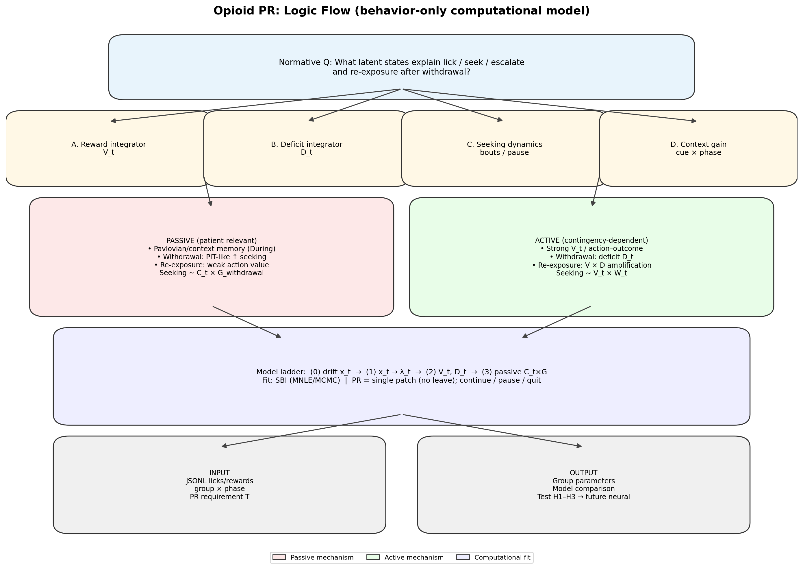

# opioid-model_wiki

**Addiction Motivational Model (AMM)** — computational spec for morphine progressive-ratio behavior (active vs yoked passive, withdrawal, re-exposure).

**Repository:** [github.com/limserenahansol/opioid-model_wiki](https://github.com/limserenahansol/opioid-model_wiki)

---

## Start here

| Role | Document |
|------|----------|
| **Anyone / LLM** | [LLM_WIKI.md](./LLM_WIKI.md) |
| **Model logic** | [model/01_LOGIC_FLOW.md](./model/01_LOGIC_FLOW.md) |
| **Equations (M0–M4)** | [model/03_MATHEMATICAL_MODELS.md](./model/03_MATHEMATICAL_MODELS.md) |
| **Data rules (run_009)** | [model/07_DATA_RULES_AND_LIKELIHOOD.md](./model/07_DATA_RULES_AND_LIKELIHOOD.md) |
| **What to fit now (Eli)** | [model/08_FITTING_PRIORITY.md](./model/08_FITTING_PRIORITY.md) |
| **Fitting pipeline** | [model/05_FITTING_WORKFLOW.md](./model/05_FITTING_WORKFLOW.md) |
| **Drive / MATLAB links** | [docs/DATA_SOURCES.md](./docs/DATA_SOURCES.md) |

---

## Model ladder

| Tier | Description |
|------|-------------|
| **M0** | Single latent engagement `x_t` (drift + noise) |
| **M1** | `x_t` → lick output `λ_t` |
| **M2** | Dual `V_t` (reward/value) + `D_t` (deficit/withdrawal) |
| **M3** | Group-specific: active `V×D` vs passive `C×G` |
| **M4** | Pause / re-engagement extension |

---

## Figure



```bash
python3 generate_logic_schematic.py   # regenerate
```

---

## Status

| Component | Status |
|-----------|--------|
| Model spec (`model/`) | Complete |
| Wiki index (`wiki/`) | Complete |
| Code (`src/`) | Planned |
