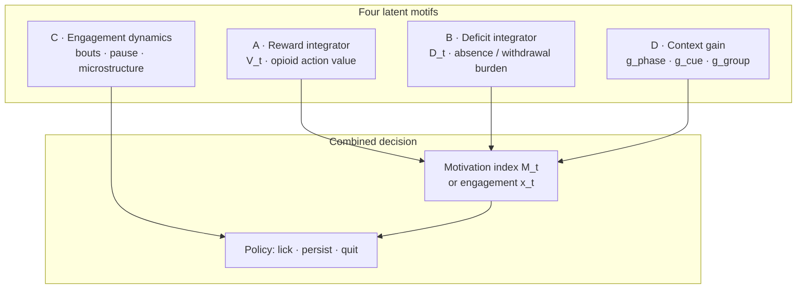
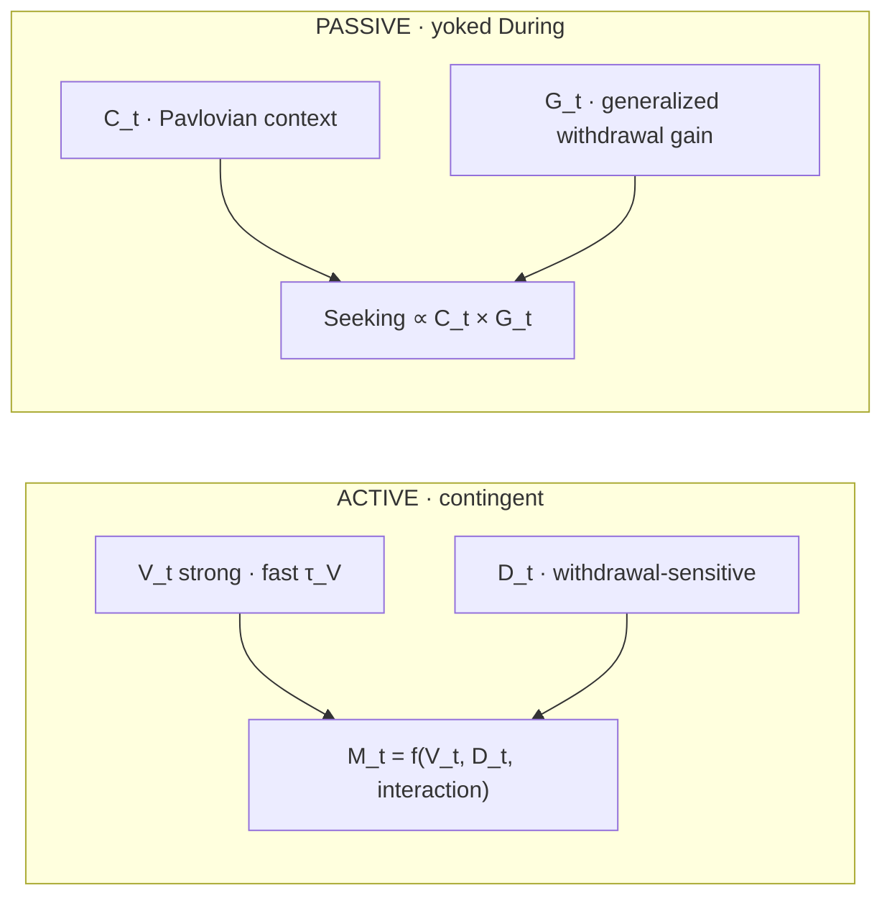
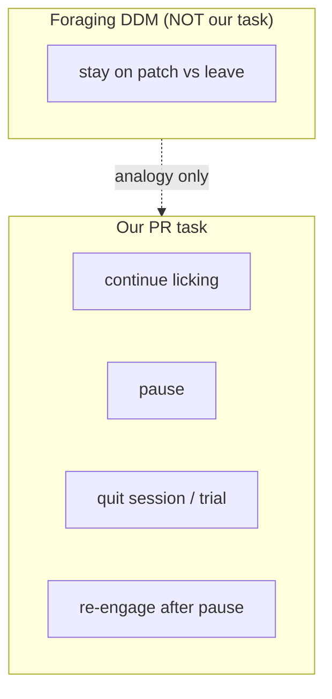

# Logic Flow — From Question to Observable Behavior

## Level 1 — Normative question

```
WHAT does the animal regulate?
  → engagement vs disengagement on PR
  → when to lick, persist, pause, quit, re-engage after abstinence

WHY do active and passive diverge after the same opioid exposure window?
  → contingency builds action–value (V)
  → passive builds context memory (C) without strong V

WHY does withdrawal change seeking differently by group?
  → active: deficit D amplifies cue-linked opioid value
  → passive: generalized gain G on Pavlovian context C
```

---

## Level 2 — Latent motifs (seminar → addiction)



| Motif | State / process | Updates when |
|-------|-----------------|--------------|
| A | `V_t` | Rewarded contingent lick; opioid delivery |
| B | `D_t` | Unrewarded lick; pause; withdrawal phase |
| C | bout state | ILI, pause duration (M4 / future HMM) |
| D | gains `g` | Phase, cue, chamber, group history |

**Design rule:** never explain addiction with **V alone** — always allow **V and D** (and group-specific **C, G**).

---

## Level 3 — Group architectures



### Active pathway (contingency-dependent)

1. **During:** action → morphine strengthens `V_t`
2. **Post:** `V_t` consolidates → high PR persistence
3. **Withdrawal:** `D_t` rises (violated expectation)
4. **Re-exposure:** `V_t × D_t` (or `M_t` threshold) → amplified seeking

### Passive pathway (patient-relevant, not null control)

1. **During:** opioid paired with context; licks `valid: false` → weak `V_t`
2. **Post:** emerging instrumental `V_t` (slow)
3. **Withdrawal:** `C_t × G_t` → can **increase** PR without strong `V_t` (PIT-like)
4. **Re-exposure:** limited reinstatement; possible extinction of expectation

---

## Level 4 — Task mapping (PR ≠ foraging leave)



Animal does **not** need explicit knowledge of ratio schedule `T`. Local events (rewarded / unrewarded lick) drive latent state; rising `T` only changes **expected** input if using smoothed `r(t)`.

---

## Level 5 — Observable behavior

| Observable | Latent driver (primary) |
|------------|-------------------------|
| `requirementLast` (breakpoint) | Integrated `M_t` or `x_t` over session |
| Lick rate / bursts | `λ_t = f(x_t)` or bout oscillator |
| Re-engagement after pause | `x_t` or `M_t` crossing θ_up |
| Phase × group interaction | Different parameters in M2 / M3 |

---

## Logic summary table

| Stage | Active | Passive |
|-------|--------|---------|
| Learning During | ΔV from contingency | ΔC from pairing |
| Withdrawal | ↑D, modulated seeking | ↑G, C×G seeking |
| Re-exposure | V×D rebound | weak V, partial extinction |
| Translational read | Organized craving | Passive → instrumental vulnerability |

Next: [02_STATE_ARCHITECTURE.md](./02_STATE_ARCHITECTURE.md) · [03_MATHEMATICAL_MODELS.md](./03_MATHEMATICAL_MODELS.md)
