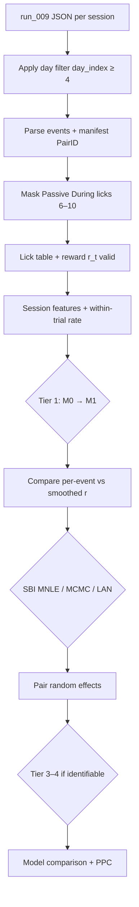

# Fitting Workflow

End-to-end pipeline from **run_009 JSON** to model comparison.

**Prerequisites:** [07_DATA_RULES_AND_LIKELIHOOD.md](./07_DATA_RULES_AND_LIKELIHOOD.md) · [08_FITTING_PRIORITY.md](./08_FITTING_PRIORITY.md) · [DATA_SOURCES.md](../docs/DATA_SOURCES.md)

---

## Pipeline diagram



---

## Step 0 — Load data

| Source | URL |
|--------|-----|
| JSON extract | [Drive](https://drive.google.com/drive/folders/1tmojU4ahssZEvAdNGa5w6BfPAYERuYsV?usp=drive_link) |
| README / 5-file subset | [Drive bundle](https://drive.google.com/drive/folders/12QMUiNDzg3gf822YJkQBE0D0QJrXH2Kf) → `README_for_Eli.md` |
| MATLAB rules | [opioidaddiction-matlab](https://github.com/limserenahansol/opioidaddiction-matlab) |

---

## Step 1 — Ingest & filter

**Filters (mandatory):**

```python
df = df[df.day_index >= 4]
```

**Output columns:**

| column | type | notes |
|--------|------|-------|
| `mouse_id` | str | e.g. `6099_orange` |
| `group` | active \| passive | from manifest |
| `PairID` | str/int | yoked pair |
| `phase` / `Period` | str | Pre, During, Post, … |
| `day_index` | int | ≥ 4 |
| `lick_observed` | bool | False if passive During lockout |
| `reward_observed` | bool | True for yoked injector |
| `rewarded` | bool | from event alignment |
| `requirement_T` | int | PR step |
| `t_sec` | float | event time |

---

## Step 2 — Likelihood assembly

For each time step:

1. If `reward_observed`: apply `r(t)` to state (`+R` on delivery).
2. If `lick_observed`: apply lick `r`, include `P(lick | x_t)` (M1).
3. If `not lick_observed` (lockout): **omit** lick factor; **do not** set rate to 0.

**Hierarchy:** `PairID` random intercept / random slope on key params (`R`, `τ`) for group summaries.

---

## Step 3 — Starter sessions

| Role | Mouse | Days |
|------|-------|------|
| Active PR | `6099_orange` | 12 or 13 (Post) |
| Passive PR | `6099_red` | 6–10 (During) |

Run M0→M1 on these before full cohort.

---

## Step 4 — Model tiers

| Tier | Action |
|------|--------|
| 1 | Fit M0, then M1 (`softplus` or logistic output) |
| 2 | Refit with per-event `r` vs `E[r\|T]`; compare `τ, α, σ` |
| 3 | M2 only if [identifiable](./08_FITTING_PRIORITY.md) |
| 4 | M3b passive `C×G` only if Tier 3 or passive withdrawal residual |

---

## Step 5 — Simulation-based inference

**Methods:** MNLE (preferred per Eli), MCMC, LAN.

**Summaries for ABC / MNLE:**

- `requirementLast` (breakpoint)
- within-trial lick rate slope
- mean ILI, pause distribution
- re-engagement count

**Simulate** with same lockout masking as data.

---

## Step 6 — Validation targets

| Check | Pass |
|-------|------|
| M1 PPC | Simulated breakpoint ≈ data |
| Within-trial slowing | Negative slope in data; drift model reproduces |
| Active vs passive Tier 1 | Different `R` or `τ` posteriors |
| Smoothed vs event `r` | Similar `τ, α, σ` |
| Lockout | Fitting without mask → worse BIC (sanity) |

---

## Step 7 — Deliverables

1. Tier 1 posteriors: `R, L, τ, α, σ, θ_stop` × group × phase  
2. Pair-level random effects table  
3. Per-event vs smoothed comparison plot  
4. Latent trace `x_t` vs licks (one session each group)  
5. Decision memo: proceed to M2? (identifiability)  

---

## Planned code layout

```
src/
  ingest/json_run009.py      # manifest + lockout mask
  features/within_trial_rate.py
  models/m0_drift.py
  models/m1_output.py
  fit/sbi_mnle.py
  fit/hierarchical_pair.py
```

**Status:** spec only — Eli may prototype in parallel.

---

## Dependencies (target)

- `numpy`, `pandas`, `scipy`
- `sbi` or Eli’s MNLE stack
- optional: `jax`, `bambi` / `statsmodels` for pair RE

Next: [06_PREDICTIONS.md](./06_PREDICTIONS.md)
