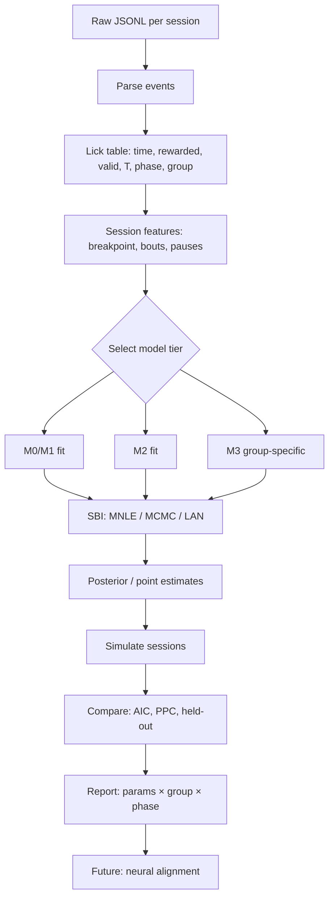

# Fitting Workflow

End-to-end pipeline from JSONL to model comparison. **No email steps** — engineering workflow only.

---

## Pipeline diagram



---

## Step 1 — Ingest

**Input:** `{cage}{mouse}_{phase}{day}.jsonl` + `mouse_info.csv` (group)

**Output columns:**

| column | type |
|--------|------|
| `mouse_id` | str |
| `group` | active \| passive |
| `phase` | str |
| `day` | int |
| `lick_idx` | int |
| `t_sec` | float |
| `rewarded` | bool |
| `valid` | bool |
| `requirement_T` | int |
| `trial` | int |

---

## Step 2 — Features (behavioral summary)

Per session:

- `requirementLast` (breakpoint)
- `n_licks`, `n_rewards`, `mean_ILI`, `n_bouts`
- `max_pause_sec`, `n_reengagements`

Used for **summary-level** model checks; lick-level for simulation.

---

## Step 3 — Model tier selection

| Question | Start with |
|----------|------------|
| Do groups differ at all on persistence? | M0 |
| Is lick rate nonlinear in latent state? | M1 |
| Re-exposure needs withdrawal interaction? | M2 |
| Passive withdrawal without high V? | M3b |
| Pause structure matters? | M4 |

**Rule:** never skip M0 baseline before M2.

---

## Step 4 — Simulation-based inference

**Why SBI:** stochastic lick process; likelihood not closed form.

**Methods:** MNLE, neural likelihood (LAN), ABC-MCMC.

**Target summaries for ABC (if used):**

- breakpoint distribution
- mean licks per trial
- pause duration distribution
- re-engagement count

**Loss for MNLE:** multivariate Gaussian on summary stats per session.

---

## Step 5 — Model comparison

| Criterion | Use |
|-----------|-----|
| AIC / BIC | nested models (M0 vs M1) |
| Held-out sessions | same mouse, different days |
| Posterior predictive check | simulate lick trains vs data |
| H2 | interaction term in M2 on re-exposure |
| H3 | M3b vs M2 on passive withdrawal |

**Report table:**

```
model | group | phase | param | estimate | CI
M2    | active | reexposure | beta | ... | ...
```

---

## Step 6 — Deliverables

1. Parameter posteriors by group × phase  
2. Simulated vs observed breakpoint (violin)  
3. Example latent trace `M_t` or `x_t` under best model  
4. Model comparison table (ΔAIC)  
5. Figure: [logic flow schematic](../logic_flow_schematic.png)

---

## Planned repository layout

```
src/
  ingest/jsonl_parser.py
  features/session_features.py
  models/m0_drift.py
  models/m2_dual.py
  models/m3_group.py
  fit/sbi_runner.py
  simulate/session_sim.py
```

**Status:** not implemented — wiki spec is source of truth until `src/` lands.

---

## Dependencies (target)

- `numpy`, `pandas`, `scipy`
- `sbi` or custom MNLE
- optional: `jax` for differentiable simulate

Next: [06_PREDICTIONS.md](./06_PREDICTIONS.md)
