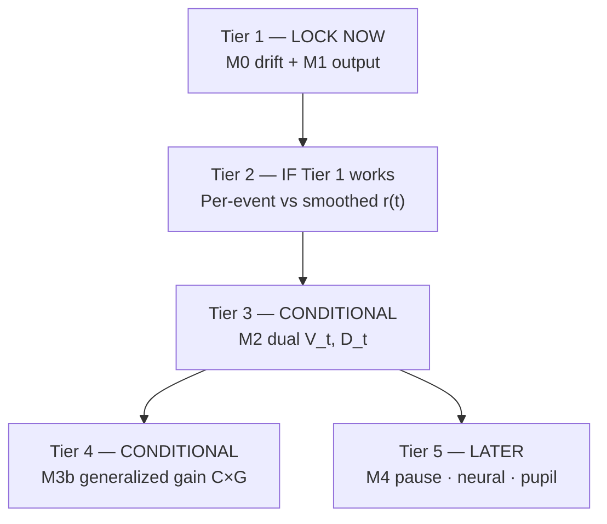

# Fitting Priority & Identifiability (Hansol–Eli alignment)

Distilled **modeling agreement** — not correspondence. Defines what to fit **now** vs **later**.

---

## Priority tiers



| Tier | Model | Status |
|------|-------|--------|
| **1** | M0 single-state drift; M1 `λ = softplus(x)` | **Primary deliverable** |
| **2** | Compare per-lick `r` vs `E[r\|T]` | Sanity / Eli closed-form link |
| **3** | M2 `V_t`, `D_t`, interaction | Only if identifiable |
| **4** | M3b `C_t × G` (passive generalized motivation) | Interpretive extension of passive withdrawal |
| **5** | M4 pause; pupil-linked `D_t`; neural | After behavior + extra data |

**Eli may proceed independently on Tier 1–2** (MNLE/SBI) before full meeting; meeting = Monday 10:00 CNC (confirm locally).

---

## Shared conceptual core (both agree)

1. Mouse does **not** represent full PR schedule explicitly.
2. Each lick (or reward event) updates an internal valuation **`x_t`**.
3. **`x_t` is hidden motivational value**, not lick rate.
4. PR ≈ single foraging patch **without leave** — model continue / quit / pause, not patch switch.
5. Fit with **simulation-based inference** (MNLE, MCMC, LAN) — not hand-tuned plots only.

---

## Equations (Tier 1 — locked)

**State:**

```
dx/dt = ((α + r(t)) / τ) dt + (σ/τ) dW
```

**Observation (M1):**

```
λ_t = softplus(x_t)   OR   P(lick_t) = logistic(x_t)
```

**Quit:**

```
disengage if x_t < θ_stop
```

**Reward input:**

```
r = +R  if rewarded
r = −L  if unrewarded (observed lick)
```

**Smoothed (Tier 2):**

```
E[r | T] = R·(1/T) − L·((T−1)/T)
```

Exactly **one** of `T` licks rewarded at PR step `T`.

---

## Tier 3 — Dual state (M2): identifiability caveats

**Problem:** Behavior alone identifies **`M_t = V_t − D_t`**, not `V_t` and `D_t` separately (constant shift in both → same likelihood).

**Possible constraints (run_009):**

| # | Constraint | If valid |
|---|------------|----------|
| i | Pupil diameter → proxy for `D_t` / arousal | Joint behavior + pupil fit |
| ii | Prior: passive on non-lockout days → `V_t ≈ 0` | Passive driven by `D_t` or `G` only |
| iii | `PairID` yoking → tie `V` structure within pair | Hierarchical pair model |

**Rule:** If none hold in practice → **drop M2 to “future work”** in papers; do not report unidentified `V` and `D` separately.

**H2 test (only if Tier 3 runs):** interaction `β·V·D` on re-exposure days 17–18, active mice.

---

## Tier 4 — Generalized motivation (reframed M3b)

**Do not claim literal PIT** — task has no separate Pavlovian-only phase; reviewers will push back.

**Instead test:**

```
drive_passive(t) ∝ C_t · G_withdrawal
```

- `C_t`: context / cue trace from opioid-paired exposure (During)
- `G_withdrawal`: scalar or phase gain on withdrawal

Same hypothesis as “PIT-like passive withdrawal ↑ PR” without Pavlovian-instrumental transfer jargon.

If Tier 4 is weak → keep as **interpretive layer** on Tier 1 parameters (`α`, context gain), not a separate fit.

---

## Approach 2 (Eli) — deferred

Alternative paradigm: chunked FR with diminishing reward probability (foraging-like). **Not current scope.** Revisit only if Tier 1–2 fail to separate groups/phases.

---

## References (methods)

| Topic | Note |
|-------|------|
| Foraging DDM | Stay/leave ≠ our task; reuse drift idea for **engagement** only |
| MNLE / SBI | Preferred fitting; use published simulation-inference packages |
| Closed form | `σ = 0` → exponential integral solution for smoothed `r(T)` intuition |

---

## What to report after Tier 1

1. Posterior / MLE: `R, L, τ, α, σ, θ_stop` by group × phase  
2. PPC: breakpoint, within-trial lick slowing  
3. Active (`6099_orange` Post) vs passive (`6099_red` During) parameter differences  
4. Explicit note: lockout-masked licks excluded from lick likelihood  

Next: [07_DATA_RULES_AND_LIKELIHOOD.md](./07_DATA_RULES_AND_LIKELIHOOD.md)
