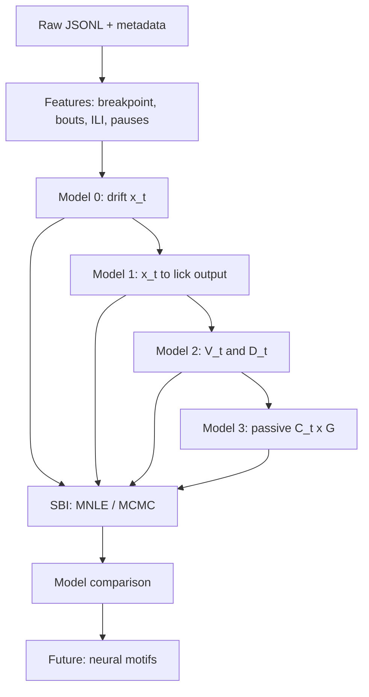

# Workflow & Artifacts

## End-to-end pipeline



## Artifacts in `opioid_behavioral_model/`

| File | Purpose |
|------|---------|
| `LLM_WIKI.md` | Agent entry point |
| `wiki/*.md` | Modular wiki pages |
| `PROPOSAL_WORKFLOW_KR_EN.md` | Bilingual proposal for grants / CS |
| `EMAIL_CS_COLLEAGUE.md` | Email draft (plain equations) |
| `EMAIL_CS_COLLEAGUE.docx` | Word-friendly email |
| `generate_logic_schematic.py` | Build PNG schematic |
| `logic_flow_schematic.png` | One-page logic figure |

Regenerate schematic:

```bash
cd opioid_behavioral_model && python3 generate_logic_schematic.py
```

## CS collaboration workflow

1. Share raw JSONL + metadata (group, phase, lockout)
2. Colleague fits **Model 0** (single-state drift)
3. Agree: `x_t` = hidden value, not lick rate → **Model 1**
4. Compare **Model 2** (dual) and **Model 3** (passive PIT)
5. Report parameters + simulations per group/phase

**Meeting:** Thu morning CNC or Fri (user availability).

## Grant / Specific Aims integration

When editing aims, include:

- Behavior-only latent-state framework (before neural)
- Passive as **patient-relevant** route, not filler control
- Staged model comparison + SBI
- Distinct mechanisms: active `V×D` vs passive `C×G`

## Related docs (in repo)

| Path | Content |
|------|---------|
| [docs/MORPHINE_PR_EXPERIMENT.md](../docs/MORPHINE_PR_EXPERIMENT.md) | Timeline, JSONL, readouts |
| [LLM_WIKI.md](../LLM_WIKI.md) | Agent hub |

## Expected deliverables (v1 success)

- [ ] JSONL → lick-level table parser
- [ ] Model 0–1 fit on ≥1 cohort
- [ ] Group parameter table (active vs passive)
- [ ] Model comparison on re-exposure & withdrawal sessions
- [ ] Figure: schematic + example latent trace vs licks

## Versioning

- Wiki tracks **conceptual** model; code may lag.
- If code contradicts wiki, **update wiki after intentional code change**.
